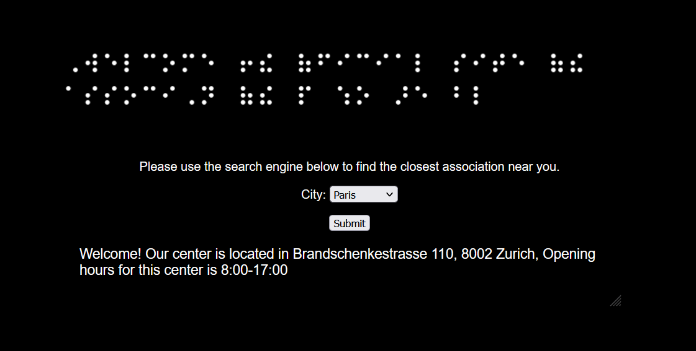
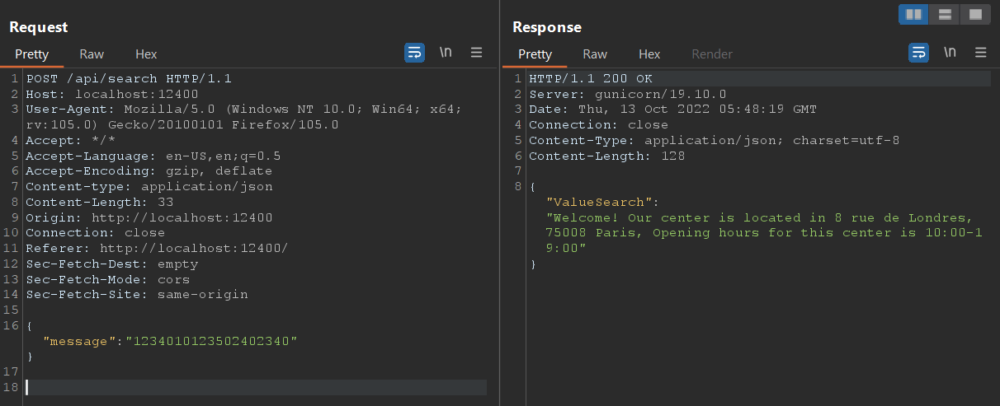
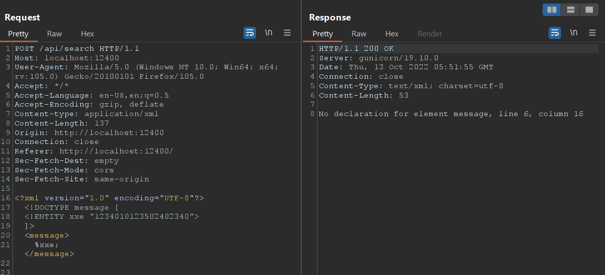
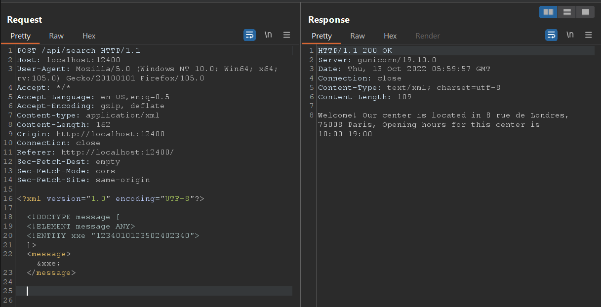
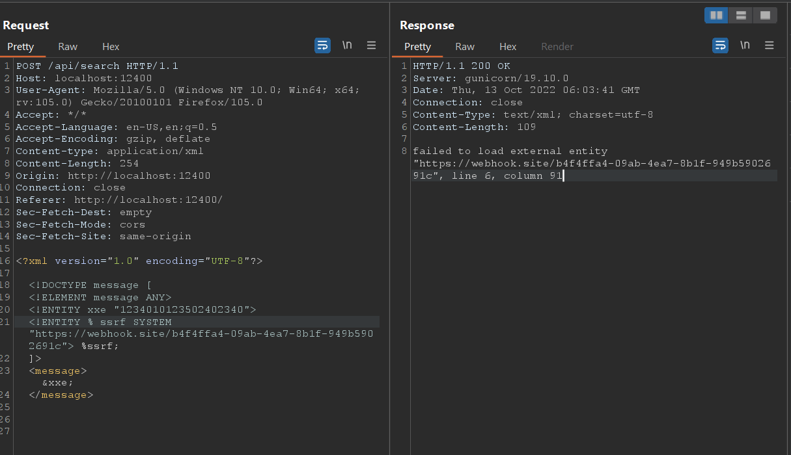
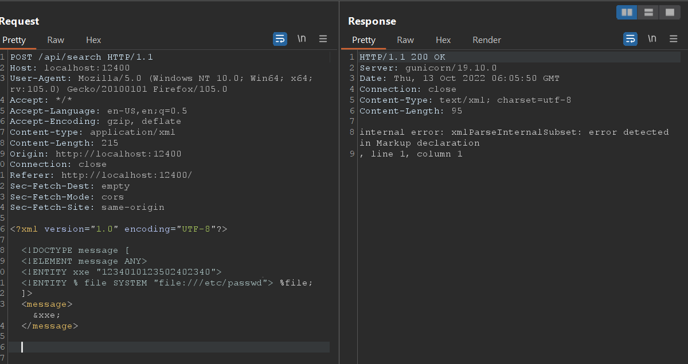
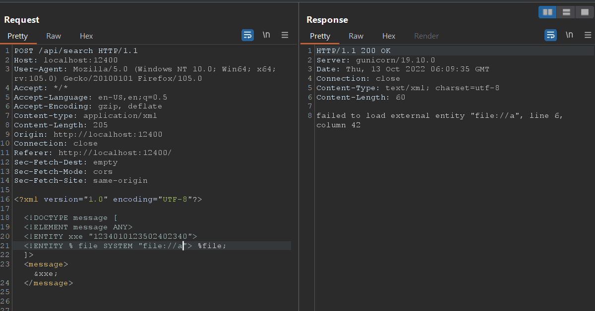
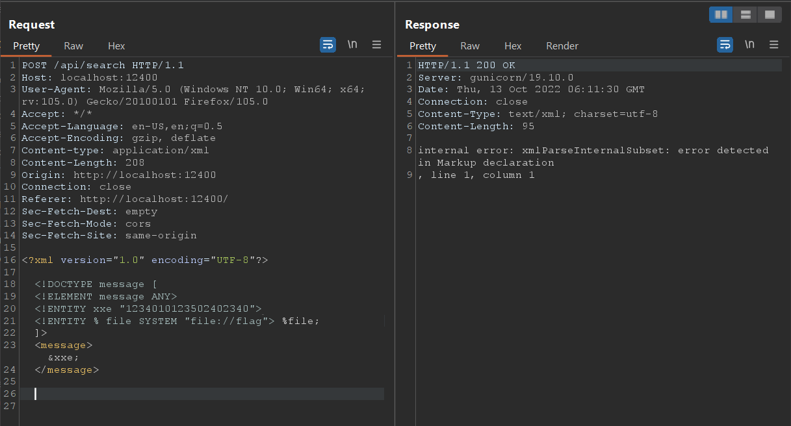
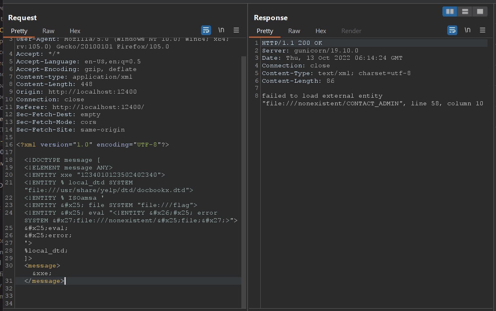

# Writeup bnv challange - Google CTF 2019
## A. Enum
Đầu tiên challange cho ta một trang web có thể chọn bất kỳ một thành phố nào để submit tìm kiếm cuộc hội thoại gần đó :vvvvvv :

Sau khi dùng Burp để bắt request thì ta thấy, web giao tiếp bằng json thông qua endpoint là ``/api/search``:

Ta có thể thấy ``message`` ứng với một dãy số, ta thử thay đổi giá trị dãy số nhưng cũng không khai thác được gì

Sau một hồi search gg thì em phát hiện có thể thực hiện XXE thông qua json endpoint. Ta chỉ cần thay đổi ``Content-Type`` từ application/json thành ``application/xml``

## B. Exploit
Ta thử xxe bằng payload sau:

Ta thấy response trả về bảo là ta chưa khai báo element tên là message, ta tiến hành khai báo message elemetn:

Ta đã test xxe thành công, tiếp theo ta sẽ thử thực hiện SSRF bằng XXE:

Challage không cho ta thực hiện SSRF, vì không thể SSRF nên cũng sẽ không cần thử error message thông qua SSRF luôn

Ta thử đọc file /etc/passwd :

Ta thấy respone trả về cho ta lỗi, theo em tìm hiểu thì lỗi này có nghĩa là XML parser đã đọc được file nhưng vì file đó không phải format chuẩn của XML nên sinh ra lỗi

Ta thử đọc file không tồn tại là ``a`` thì nó sẽ cho kết quả:

Từ đây ta có thể thực hiện brute force xem file flag nằm ở đâu, ăn may sao thử /flag thì ta thấy có tồn tại file flag tại thư mục hiện tại

Mục tiêu tối thượng bây giờ là tìm cách đọc file flag, ta không thể thực hiện SSRF nên không thể include external DTD được vì thế chỉ còn một cách là repurposing lại file DTD trong hệ thống.

Ta thực hiện repurposing lại file ``/usr/share/yelp/dtd/docbookx.dtd`` . Đây là file DTD mặc định trong Linux và nó có custome entiy là ``ISOamsa``:

Flag sẽ nằm sau ``file:///nonexistent/``. Vì dựng lại docker nên ta sẽ không thấy flag của challange này.
