# Labs File Upload Vulnerability Portswigger

## 1. Giới thiệu
Upload file là một chức năng phổ biến và thông dụng trong các ứng dụng web. Tuy nhiên nếu không có giải pháp validate file upload đúng cách, thì attacker có thể lợi dụng để upload các file shell lên sever để thực hiện bất kỳ đoạn nào.

## 2. Cách sever xử lý request của một file
Đầu tiên sever sẽ check path của request để xác định extension của file. Sau đó sever sẽ so sánh extension với một list mapping giữa extension và MIME type để xác định file thuộc định dạng nào. Tiếp theo tùy từng loại file mà sẽ được xử lý.

- Nếu là file không thể thực thi (non-executable) như file ảnh, file HTML tĩnh thì sever chỉ việc gửi nội dung file cho response
- Nếu là file có thể thực thi (executable), như file PHP, và sever được config để có thể thực thi được loại file này, thì file sẽ được thực thi và output sẽ được trả về cho response
- Nếu là file có thể thực thi nhưng sever không được config để có thể chạy được loại file này, thì trả về error message cho response. Tuy nhiên một vài trường hợp thì nội dung file cũng có thể được trả về cho response dưới dạng plaintext

## Lab1 Portswigger
Ở labs này sẽ cho ta một trang blog và yêu cầu ta đọc nội dung file ``/home/carlos/secret`` của sever, ta có thể đăng nhập bằng account ``wiener:peter``, và có thể thực hiện upload ảnh avatar. Tuy nhiên labs không thực hiện bất kỳ hình thức validate nào nên ta có thể upload bất kỳ file nào kể cả file shell

Ta thử upload file ``shell.php`` với nội dung:
```php
<?php echo file_get_contents('/home/carlos/secret'); ?>
```

Upload shell lên labs và ta thấy vị trí của file shell tại tag img của avatar:

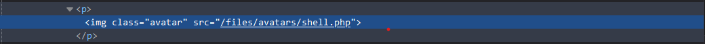

Ta thực hiện truy cập đén ``/files/avatars/shell.php`` và đọc được nội dung của file /home/carlos/secret

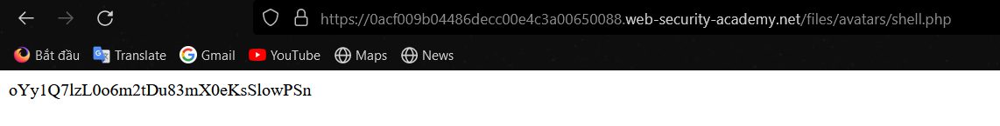

## Lab2 Portswigger
Ở bài này thì cũng tương tự như lab1 nhưng đã có thêm 1 lớp bảo mật khi nếu upload file shell thì nó sẽ hiển thông báo lỗi:

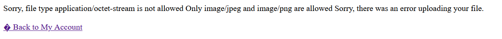

Để bypass ta chỉ cần thay ``Content-Type`` của file shell từ application/octet-stream thành image/png hoặc image/jpeg

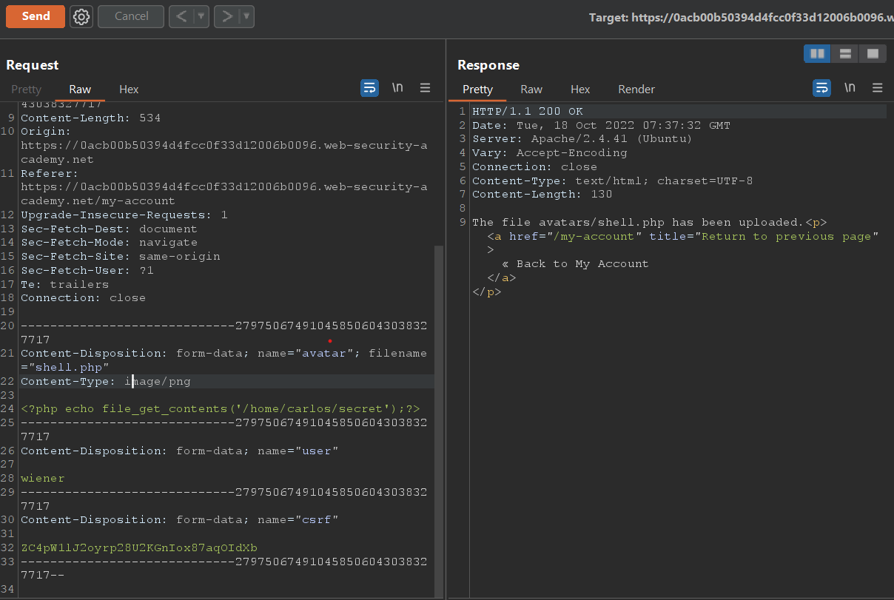

Tương tự lab1 chỉ cần truy cập đến ``files/avatars/shell.php`` để trigger file shell

## Lab3 Portswigger
Ở labs này cho ta thông tin là tại thư mục upload file của người dùng đã được config sao cho không thể execute được file shell. Và yêu cầu của lab vẫn là đọc file ``/home/carlos/secret``

Ta có ý tưởng là sẽ lợi dụng path traversal để thoát khỏi thư mục hiện tại, và thực hiện execute code tại thư mục khác mà không bị sever chặn 

Ta thử upload một file shell thông thường thì vẫn upload thành công tuy nhiên ta không thể trigger nó được:

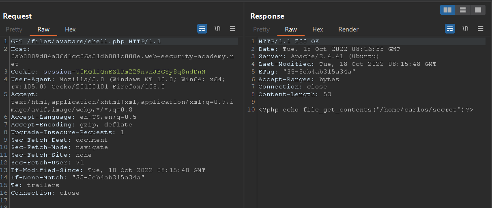

Ta có thể thấy sever chỉ xem file shell nằm trong thư mục ``files/avatars`` như một planitext

Ta thử upload một file shell, nhưng thay ``filename`` trong request thành ``../shell.php``

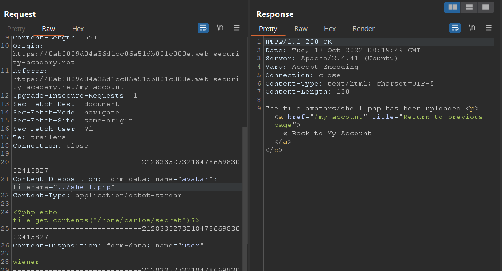

Ta có thể thấy ở response thông báo thì file vẫn được lưu ở ``avatars/shell.php`` nên em nghĩ dấu ``/`` đã bị filter. Em thử encode dấu ``/`` thì exploit thành công

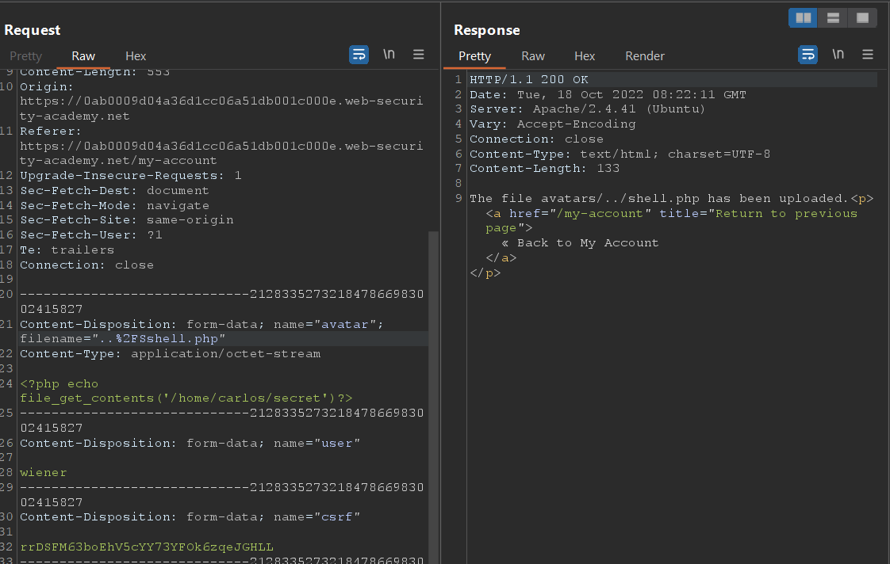

Upload thành công ta chỉ cần truy cập ``files/shell.php`` để trigger file shell:

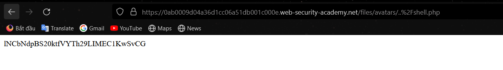

## Lab4 Portswigger
Ở lab này thì vẫn là trang web tương tự các lab khác tuy nhiên lab này khi đổi ``Content-type`` vẫn ko upload được file, theo mô tả của lab thì web có blacklist sẽ chặn các file có đuôi php

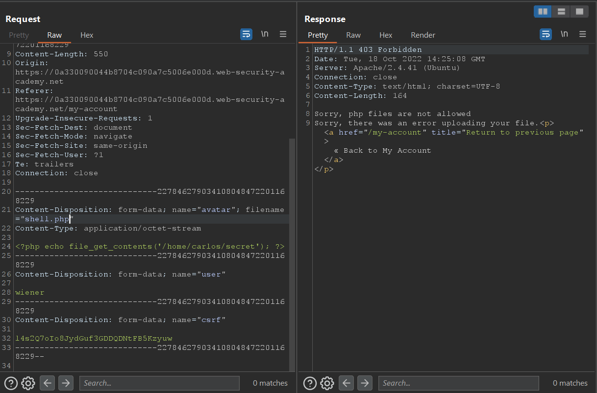

Ta thử dùng đuôi ``phtml``:

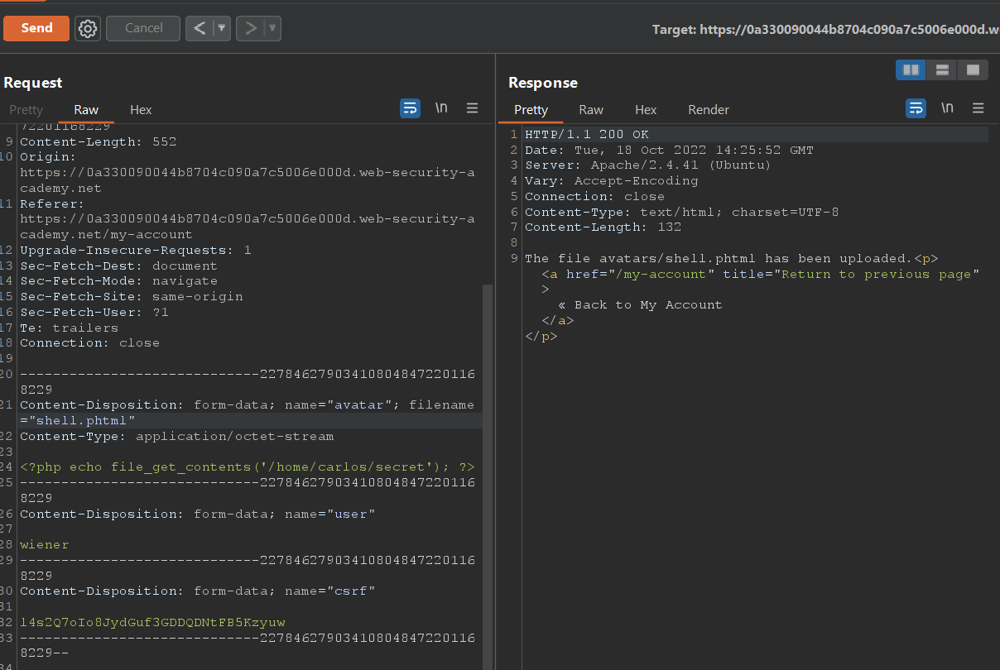

Ta đã upload được file shell giờ chỉ cần gọi tới để trigger file

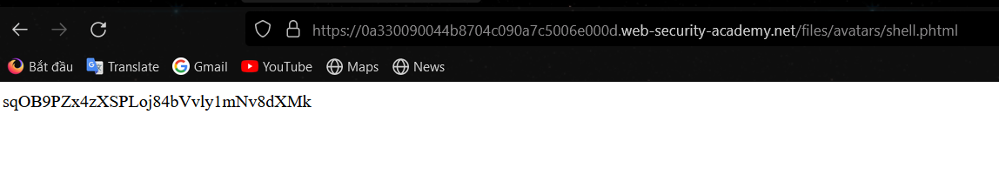

## Lab5 Portswigger
Ở bài này mô tả gợi ý ta bypass bằng cách sử dụng kỹ thuật classic obfuscation 

Đầu tiên em thử upload file php bình thường thì web báo lỗi chỉ nhận file PNG hoặc JPG

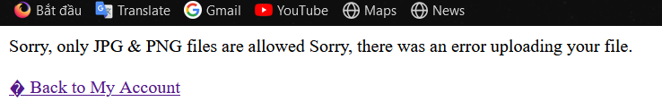

Sau đó em thử double extension thành ``.php.png`` thì upload được file:

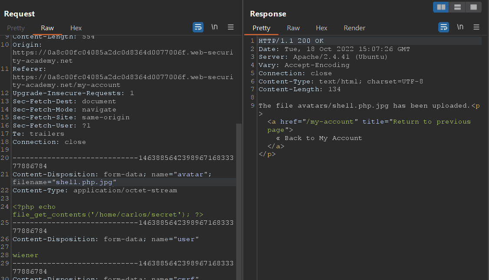

Upload file thành công tuy nhiên ta không thể thực hiện trigger được file, vì thế ta phải dùng cách khác

Ta thử dùng ``null character``:

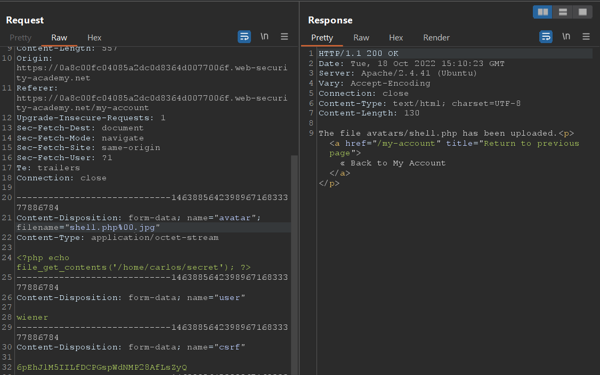

Giờ ta chỉ cần trigger đến file shell

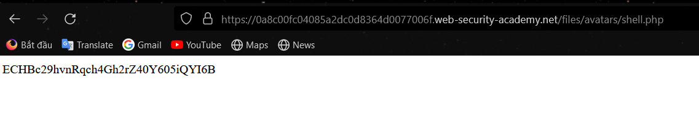

>Giải thích : null character là một ký tự đặc biệt có chức năng kết thúc một string hoặc ngăn cách các char. Mã URL của null byte là %00 hoặc \x00 . PHP khi xử lý file sẽ sử dụng các hàm cơ bản của C ta có thể lợi dụng điều này để thực hiện ``null character injection``

> Ở bài lab trên thì khi ta upload file ``shell.php%00.png`` thì tại hàm validate của PHP nó nhận thấy có đuôi là .png nên ta bypass được, nhưng khi PHP thực thi file này thì những hàm trong C khi đọc tới ``%00`` sẽ ngầm hiểu là tên file đã kết thúc nên sẽ chỉ thực hiện ``shell.php``

## Lab6 Portswigger
Ở lab này thì khi upload file cho dù thay đổi extension hay Content-type đều không được, theo gợi ý từ mô tả của lab thì lab sẽ check nội dung của file để validate có phải là file ảnh hay không

Để bypass ta chỉ cần thêm ``GIF98`` hoặc ``GIF98A`` vào đầu file

> ``GIF98`` và ``GIF98A`` là magic byte của một file ảnh. Magic byte là các bit đầu của một file giúp xác định file này thuộc định dạng nào

Khi thêm ``GIF98`` vào đầu file shell thì upload thành công:

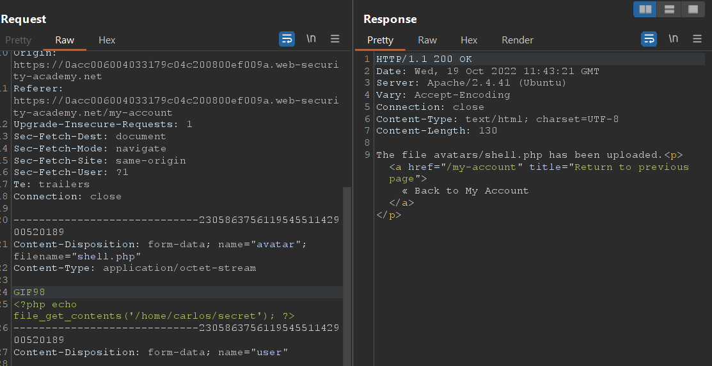

Truy cập file shell để trigger

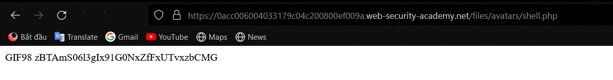

## Lab7 Portswigger
Ở lab này thì mô tả gợi ý ta dùng kỷ thuật ``race condition`` để thực hiện exploit

Theo code hint của lab
```php
<?php
$target_dir = "avatars/";
$target_file = $target_dir . $_FILES["avatar"]["name"];

// temporary move
move_uploaded_file($_FILES["avatar"]["tmp_name"], $target_file);

if (checkViruses($target_file) && checkFileType($target_file)) {
    echo "The file ". htmlspecialchars( $target_file). " has been uploaded.";
} else {
    unlink($target_file);
    echo "Sorry, there was an error uploading your file.";
    http_response_code(403);
}

function checkViruses($fileName) {
    // checking for viruses
    ...
}

function checkFileType($fileName) {
    $imageFileType = strtolower(pathinfo($fileName,PATHINFO_EXTENSION));
    if($imageFileType != "jpg" && $imageFileType != "png") {
        echo "Sorry, only JPG & PNG files are allowed\n";
        return false;
    } else {
        return true;
    }
}
?>
```

Nếu 1 trong 2 hàm checkViruses và checkFileType false thì file sẽ bị xóa bởi hàm unlink.

Idea ở đây thì ta sẽ liên tục gửi request upload file lên sever, song song đó cũng gửi request đến endpoint của file shell là ``files/avatars/shell.php``. Trong quá trình race liên tục thì ở một thread nào đó file upload chưa kịp xóa thì ta đã truy cập vào, từ đó có thể trigger file và lấy được nội dung file ``/home/carlos/secret`` theo yêu cầu của lab

Ta dùng Intruder của Burp để thực hiện race, ta cho một tab chạy upload file và một tab trigger file chạy song song nhau với Payload type là ``Null payloads`` và cho số luồng là 100

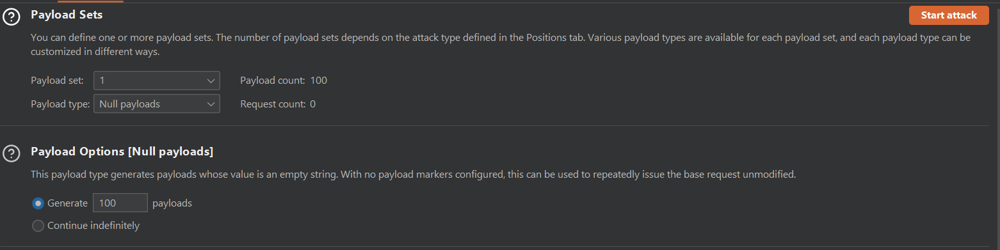

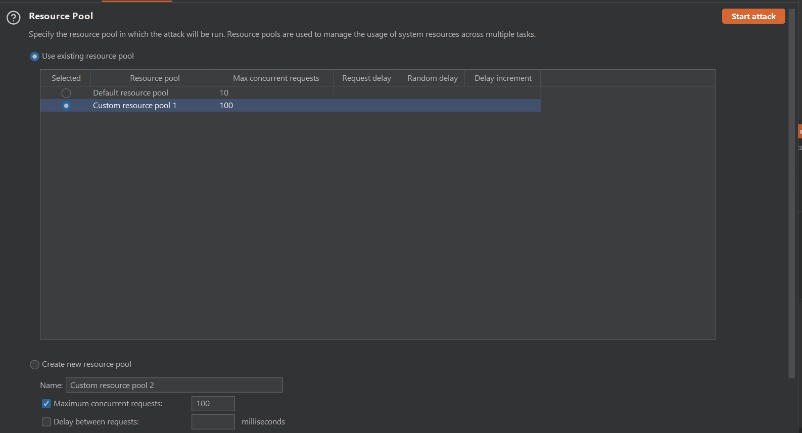

Nhấn ``Start Attack`` để thực hiện race

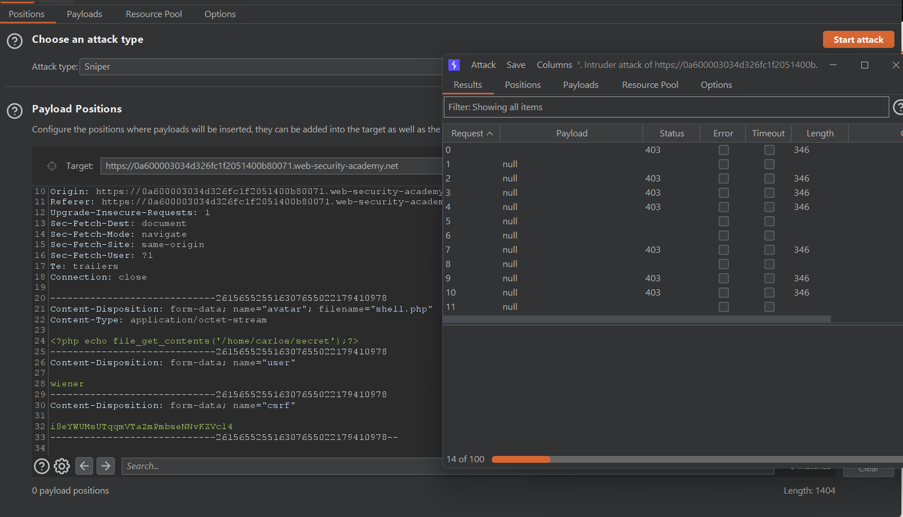

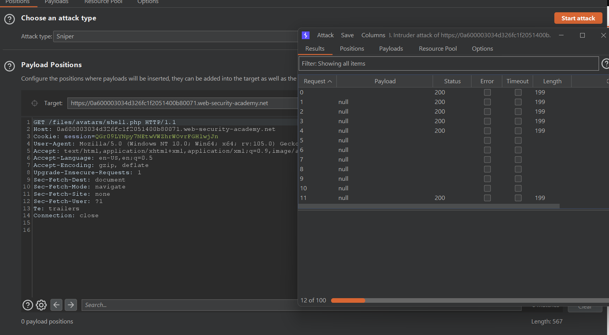

Ta truy cập vào một request bất kỳ có status code là 200 để xem response

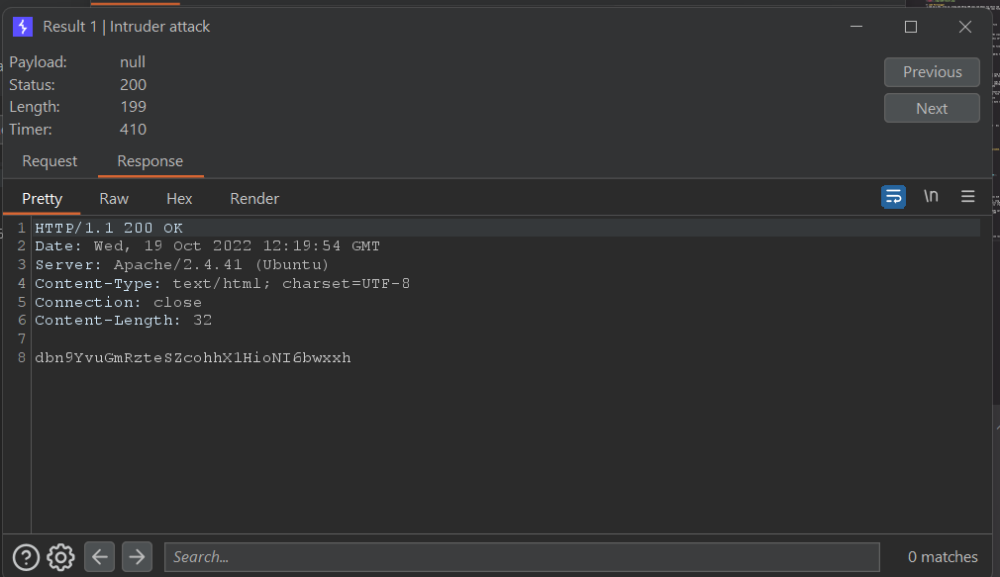


